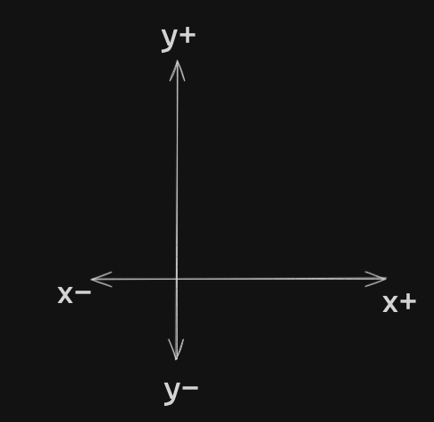

# Oppgavesett 09

Disse oppgavene kan være omfattende og utfordrende, hvor det er viktig å fortsette og fortsette! Prøv og feile, ta kontakt med medstudenter og veiledere om du sitter fast, og gjerne snakk om oppgaveteksten, ikke bare kodeforsøk!

Å snakke om oppgaveteksten med andre kan være veldig til hjelp.

Det er ikke forventet at du klarer alle disse oppgavene til i morgen eller neste uke.

Masse lykke til!

---

I disse oppgavene ønsker vi å få til at figurene skal kunne flyttes rundt på.
Huh, hva menes det med dette?

Vi kan jo ikke se figurene? Stemmer.

Dette vil vi kunne få til på et senere tidspunkt, hvor vi gjerne må ha
dette på plass for å kunne vise figurene riktig plass på skjermen for å så kunne flytte rundt på disse
figurene.

Hvordan kan vi gjøre dette?

Først og fremst, så trenger klassene våre et konsept av hvor de er, dette vil si at vi trenger x- og y-
koordinater.
Vi forholder oss kun til to dimensjoner.

Deretter trenger vi metoder som kan flytte rundt på figurene, slik at disse koordinatene oppdateres til å
alltid vise hvor figuren er.

For eksempelvis, for en sirkel, trenger vi å vite ét punkt: Sirkelens kjerne.

For andre figurer, som rektangler og kvadrater (firkanter) trenger vi to punkter:
- Topp-venstre hjørne og nedre-høyre hjørne

La oss begynne med å lage et grenesnitt for hvordan disse figurene skal flyttes rundt på...

---

## Oppgave #1

Lag et interface ved navn `Movable`. Metodene i interfacet skal være:
- moveUp(double distance)
- moveDown(double distance)
- moveLeft(double distance)
- moveRight(double distance)

Disse metodene skal ikke returnere noe

---

## Oppgave #2

Lag en klasse ved navn MovablePoint.

Denne klassen skal ha følgende felt: **x** og **y**, begge av datatypen **double**.

Klassen skal deretter implementere interfacet Movable.

Implementer metodene som interfacet krever, hvor disse metodene skal manipulere x- og y-koordinatene
ut i fra hvilken metode som kjøres, at:

- `moveUp(...)` og `moveDown(...)` påvirker y-verdien riktig
- `moveLeft(...)` og `moveRight(...)` påvirker x-verdien riktig

Til informasjon, se illustrasjonen nedenfor:



---

## Oppgave #3

Vi ønsker nå at alle figurene våre skal ha en posisjon (punkter) i et koordinatsystem som viser hvor figuren er.
Det vi ønsker er å vite er hvor på x-aksen og y-aksen figurene befinner seg.
En utfordring her er jo at figurene er forskjellige.
For sirkler trenger vi bare å vite senterpunktet til sirkelen,
hvor vi ved firkanter trenger 2 punkter (topp-venstre og bunn-høyre hjørne).

La oss forsøke her å bruke klassen `MovablePoint` til å utføre dette.

Start i `Circle`-klassen og sørg for at alle sirkler har informasjon om senterpunktet sitt,
altså slik at sirkler er plassert i et koordinatsystem.

Om du er litt usikker på hvordan gå fram her, så kan vi tenke at felter inneholder data,
og nå trenger vi å lagre data om sirkelens senterpunkt.

Lag en ny konstruktør (en ekstra en!) som også tar inn dette punktet og lagrer dette i et felt.
Oppdater de andre konstruktørene slik at dersom et punkt ikke blir gitt,
så settes punktet til å ha en x- og y-verdi som er 0.0, altså null punktum null,
da vi jobber med flyttall (double).

---

## Oppgave #4

Sørg nå for at firkanter (figurene Rectangle og Square) har en plassering i et koordinatsystem.
Husk at vi her trenger to punkter for å representere plasseringen til figuren i koordinatsystemet!

Du kan lese litt mer om hvorfor vi trenger to punkter her og ikke kun ét i bunnen av oppgavesettet.

---

## Oppgave #5

Vi ønsker nå at alle geometriske figurer skal være `Movable`.
Tenk litt på akkurat dette, hvordan kan vi få til dette?
Tygg litt på akkurat dette før du fortsetter.

Klar for å gå videre?

Her kan det være lurt å la `Shape` implementere `Movable`.
Alle geometriske figurer er jo en `Shape`.
Med dette sagt, så må det vel være bedre at Shape implementerer `Movable` enn at alle subklassene til `Shape` gjør det?

Endre klasse `Shape` slik at denne implementerer grensesnittet `Movable`.

Hva skjedde?

Du vil gjerne legge merke til at vi ikke har noen kompileringsfeil i klassen Shape.
Denne er jo abstract, men sub-klassene vil få problemer med å kompilere.
Vi sier jo nå at alle figurere må implementere metodene fra grensesnittet `Movable, men dette er ikke helt tilfelle enda!

Det hadde vært kult om vi bare kunne implementert metodene i `Shape`-klassen,
og så hadde det løst seg for alle figurene, men det er her problemet oppstår:
Ikke alle figurer er like. Sirkler har ét punkt for sin posisjon, hvor firkanter bruker to punkter.

La oss begynne med `Circle`-klassen.
Implementer metodene fra grensesnittet `Movable` i klassen slik at sirkelen kan flyttes rundt på ved å kalle disse metodene.

Her kan det også være greit å oppdatere `toString()-metoden vår slik at posisjonen (punktene) også printes ut!

---

## Oppgave #6

Sørg for at både `Rectangle` og `Square` implementerer grensesnittet `Movable`, på lik linje som i oppgave #5 over.

---
> Merk: Oppgavene under er ment å gjøres etter forelesning 10
---

## Oppgave #7

Er det mer å gjøre her? Vel, vi må jo gjerne få testet om at alt fungerer som det skal!

For å få dette til kan vi gjerne bruke polymorfisme.

Opprett en klasse ved navn TestShapes.
Opprett en main-metode som gjør følgende:

- Opprett et objekt for hver type figur
  - 1 sirkel, 1 kvadrat og 1 rektangel
- Legg disse figur-objektene inn i en ArrayList
  - Hmm, objektene er jo av forskjellig type, hvilken type skal ArrayList-en ha? 
  - Tenk litt på det. Som et hint, kan en klasse all disse objektene har til felles brukes som type her!

- Deretter:
  - Gå igjennom alle figurene i ArrayList-en og flytt de i en eller annen retning, hvilken er ikke viktig her, bare at de flyttes på
  - Etter du har flyttet på figurene, gå igjennom figurene på nytt og print ut informasjon om hver figur

Hint: Forsøk å print ut referansen til objektene direkte! Metoden toString() kommer på banen her.

Ble figurene flyttet på slik som forventet? Sjekk koordinatene som printes ut!

---

## Oppgave #8

Lag en unik metode i hver av klassene `Circle`, `Rectangle` og `Square.
Unik i den forstand at alle klassene har en egen metode som gjør noe de andre klassene ikke gjøre.
Dette kan for eksempelvis være så enkelt som at det printes ut en unik linje med tekst til terminalen.

I slutten av main-metoden i klassen `TestShapes`, opprett tre nye objekter av hver klasse, men denne
gangen skal du upcaste objekt-referansene til å være av klassen `Shape`, for eksempelvis:

```java
Shape shape1 = new Circle(1.0, "green", true, new MovablePoint(0.0, 0.0));
```

Sjekk hvilke metoder du har tilgang til via denne objekt-referansen, hvor du kan la IntelliJ hjelpe deg her
ved å begynne å skrive `shape1.` for å se hva IntelliJ foreslår. Får du tilgang til de unike metodene?

Putt disse `Shape`-objektene i en `ArrayList`, og gå igjennom hver figure og gjør følgende:
- Print ut areal og omkrets
- Kall på den unike metoden som figuren har.
  - Bruk gjerne `instanceof` her i en if-setning for å sjekke hvilket type objekt du faktisk jobber med, hvor du inne i if-setningen vil kunne referere til de unike metodene. Bruk også
  IntelliJ for å sjekke om dette faktisk stemmer ved å se på forslagene den kommer med.

---

## Ekstra informasjon

Hvorfor er det slik at vi trenger to punkter for firkanter, men kun ét for sirkler?

Den geometriske grunnen er at dersom vi hadde kun ét punkt for firkanter,
for eksempel topp-venstre hjørne, vil vi ikke ved hjelp av `getWidth()` og `getHeight()` vite i hvilken retning firkanten er så bred og så høy,
altså i hvilken retning firkanten tar opp plass.

Ved hjelp av to punkter vil vi ha informasjon angående hvilken retning firkantet tar opp plass, fra et hjørne til et annet (diagonalt fra hverandre).

Vi kunne brukt `getWidth()` og `getHeight()` for å estimere hvor nedre-høyre hjørne er eksempelvis her,
men i og med at verdiene lagret i feltene **width** og **height** alltid er positive,
så ville det ført til at nedre-høyre hjørne _alltid_ måtte vært til høyre for topp-venstre hjørne.

Ved å ha 2 punkter, kan dette taes hensyn til ved at firkanten oppstår uavhengig av hvor punktene er i forhold til hverandre.

Å kunne slik matematikk og geometri er ikke en del av pensum eller forventet,
men kanskje litt interessant som ekstra informasjon om akkurat hvorfor vi bruker to punkter for å representere hvor en firkant er, da vi ønsker best mulig kontroll over hvor firkanten er i sin helhet i et koordinatsystem!