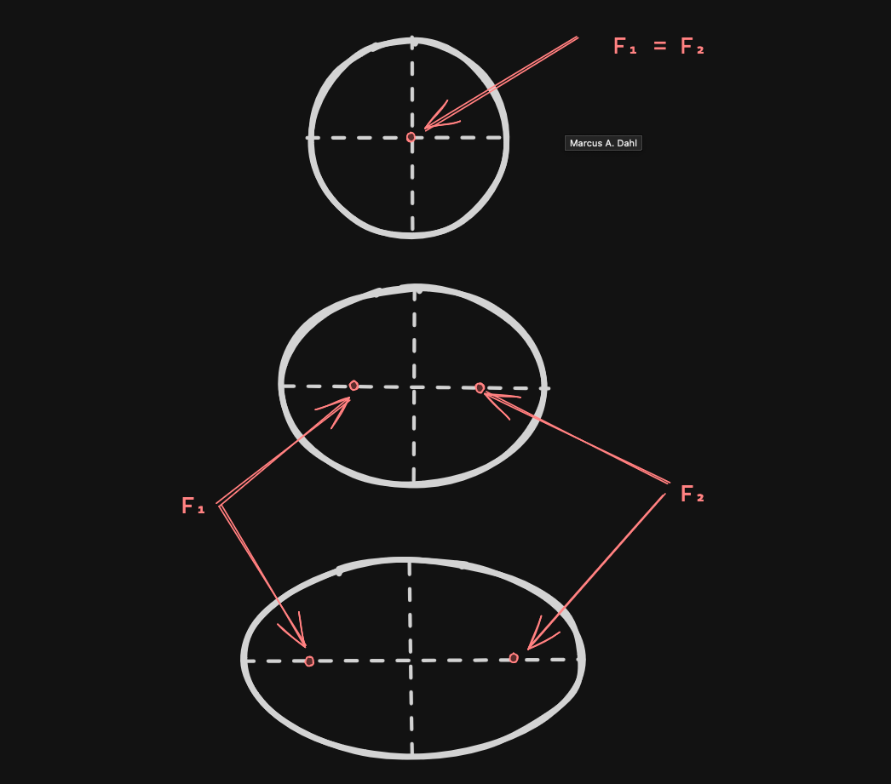
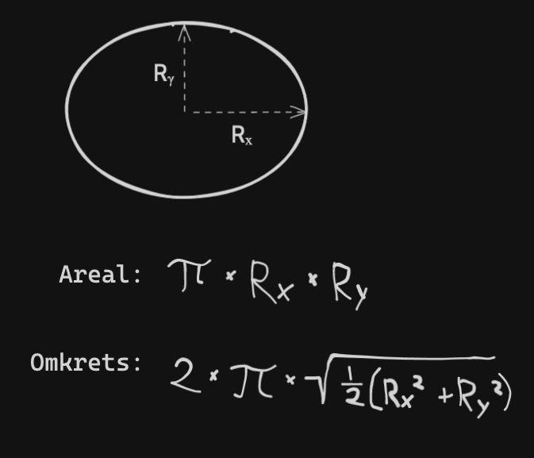

# Ekstra oppgaver -- Oppgavesett 09

Disse oppgavene vokser kjapt mtp. vanskelighetsgrad, hvor oppgave #4 regnes som veldig vanskelig og #5 som veldig-veldig vanskelig

---

## Oppgave #1

I og med at firkanter er definert ved hjelp av to punkter (*topLeft* og *bottomRight* f.eks.),
så kan det være lurt at disse punktene samsvarer med hverandre!

Valider i konstruktøren ved hjelp av if-setninger at hjørnet oppe til venstre faktisk er til venstre for punktet som er nede til høyre.

### Oppgave #2

Istedenfor et hjørne oppe til venstre og et hjørne nede til høyre, hvorfor ikke bare bruke 2 vilkårlige punkter, og firkanten er det som er i mellom disse punktene?

Gjør nødvendige endringer for å få dette til.

En "hurtigfiks" her er å endre navn på feltene

---

## Oppgave #3

Inne i konstruktørene hvor bredde og høyde settes for firkanter, bruk if-setninger for å sjekke om punktene samsvarer med bredden og høyden gitt, og om det ikke stemmer, print ut til terminalen en feilmelding (*eller* kast en exception) hvor det nevnes at punktene gitt ikke samsvarer med bredden og høyden gitt!

Det vil si, at vi må sjekke at distancen (*per akse*) mellom punktene samsvarer med bredden (*x-aksen*) og høyden (*y-aksen*).

---
> PS: Oppgavene under er vanskelig, en utfordring for de som ønsker dette!
---

## Oppgave #4

På lik linje med kvadratet (`Square`) teknist sett er et rektangel (`Rectangle`),
hvor bredden og høyden er like lange, gjelder dette også for ellipser (`Ellipse`) og sirkler (`Circle`).

En ellipse kan være bygget opp ved å bruke to forskjellige punkter som bestemmer hvordan elliopsen vil se ut.
Disse kalles for fokalpunkter, se eksempel under:

En sirkel oppstår når disse to punktene har akkurat samme posisjon.

**Men**, for å slippe å bruke trigonometri her, kan vi istedenfor to punkter bruke to ulike radiuser, se illustrasjon under for hva jeg mener med dette:

--

Gjør som følger:
- Opprett en ny klasse som heter `Ellipse` som arver fra `Shape`
  - Sørg for at konstruktøren til `Ellipse` mottar to ulike radiuser og implementerer metodene klassen `Shape` spør om

- Endre `Circle`-klassen slik at denne arver fra `Ellipse`
  - Gjør nødvendig endringer slik at `Circle`-klassen gjenbruker mest mulig kode fra klassen `Ellipse`

--

## Oppgave #5

Istedenfor å bruke to ulike radiuser for å definere en ellipse, forsøk å bruke to ulike punkter.

Da blir du nødt til å håndtere 3 punkter:
- 1x Origo (ellipsens sentrum)
- 2x Fokalpunkter (punktene som definerer ellipsen)
